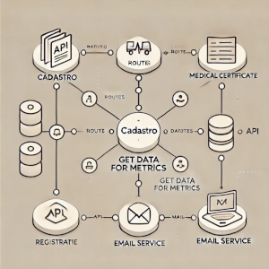

# Portfolio Website

    
    
    
    
    

## Sobre o Projeto
API de integração para o Projeto Medical Control (<a href="https://github.com/JoaoNogueira23/medical-control" style="text-decoration:none;" target="_blank">Link</a>).

## Funcionalidades
A API possui três rotas principais. A primeira é responsável pelo gerenciamento de dados cadastrais, permitindo o registro de pacientes e atestados médicos. A segunda rota serve para a obtenção de dados, visando a geração de métricas. Por fim, a terceira rota é dedicada ao serviço de envio de e-mails. Essas rotas trabalham em conjunto para realizar o cadastramento de novos pacientes e atestados, além de garantir a coleta de dados para métricas e o envio de notificações por e-mail.

## Tecnologias

    A API foi desenvolvida em Node.js, utilizando o Prisma como ORM para facilitar a interação com o banco de dados. A aplicação foi implantada no Google Cloud, com uma base de dados MySQL gerenciada pelo SQL Cloud. O deploy foi realizado no Cloud Run, garantindo escalabilidade e desempenho. Durante o desenvolvimento, o Docker foi empregado para realizar testes, além de gerenciar os ambientes e containers no momento de colocar a aplicação em produção, assegurando consistência e isolamento dos serviços.

